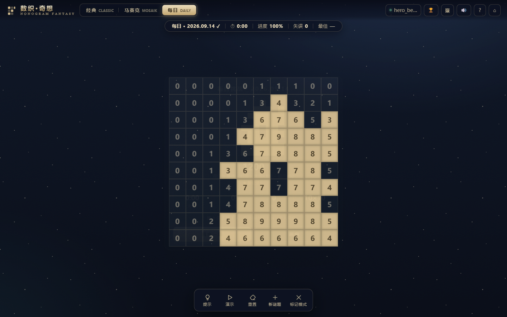
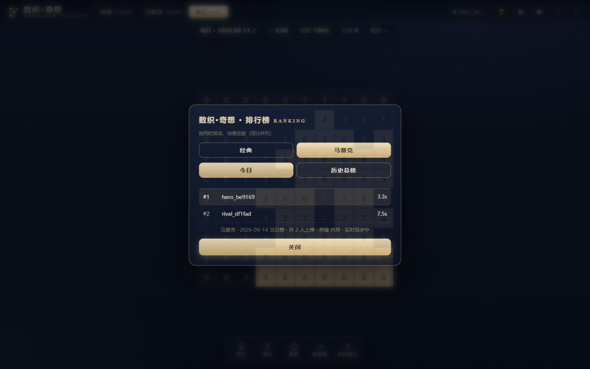

# 数织·奇想 · Nonogram Fantasy

原神风格 UI 的轻量数织（Nonogram）网页游戏。**单文件、零依赖、离线可玩**——下载 `index.html` 双击即玩。



它还**可以**联机：注册一个账号，每日挑战由服务端统一出题、计时，成绩进实时排行榜。

| 怎么打开 | 每日挑战 | 排行榜 |
|---|---|---|
| 双击文件，没后端 | 本地按日期定种子 | 无 |
| 网页托管，未登录 | 同一天全球同一道题，本地计时 | 可看，不上榜 |
| 登录后 | 服务端计时 | 实时上榜（WebSocket 推送） |

## 三种玩法

- **经典 CLASSIC**：行/列数字 = 连续填充段长度（5×5 / 10×10 / 15×15 随机）。
- **马赛克 MOSAIK**：每个格子的数字 = 以它为中心的 3×3 邻域（含自身）填充总数——推理方式完全不同。
  贴着棋盘边界的格子只统计落在盘内的部分。
- **每日 DAILY**：按日期定种子生成全服同一题（经典/马赛克隔日轮换），记录当日最佳时间与完成状态；
  连上后端时改为服务端统一出题与计时，成绩进实时排行榜（见下方「联机模式」）。

## 特色

- **唯一解保证**：每道随机谜题都经求解器验证恰好一个解（算法自带拒绝采样 + 回溯计数）；
- **画廊**：16 幅手绘像素画，解出一幅永久点亮彩色原画；
- **计分**：基础分 − 时间 − 失误×100 − 提示×50，失误即时判定（填错自动改 ✕）；
- **提示**：两种模式都优先揭示"可推理"的格子——经典走行/列约束传播，马赛克走邻域夹逼传播；
- **演示**：逐步动画展示求解器推理过程（马赛克同样是真实推理，不是直接亮答案）；
- 拖拽批量涂格 / 右键排除 / 标记模式 / 音效（Web Audio 合成，可开关）/ 移动端触控 / 进度本地存档；
- **可联机**：注册账号后每日挑战由服务端出题与计时，成绩进双玩法实时排行榜；
  不联机时一切照旧（单文件离线可玩）。

## 技术要点

- 纯 CSS Grid + DOM，零依赖单文件；数字与线索为真实文本，清晰锐利；
- 引擎（`src/engine.js`）：线索计算、单行约束传播（DP）、回溯解计数、聚块图案生成、
  马赛克 3×3 邻域夹逼传播（`mosaikPropagate`）与解计数——Node 与浏览器双端可用；
- 马赛克邻域夹逼：对每个线索格算出「邻域内已定填充数」与「未定格数」，用
  `filled ≤ clue ≤ filled+unknown` 夹逼，取等即定死整片邻域，迭代到不动点。
  正确性有回归测试保障——随机线索下推出的每一格都与暴力枚举的全部解逐一比对。
- 每日挑战种子：日期字符串先过 FNV-1a 散列（`hashSeed`）再喂给 mulberry32。
  直接用字符串会静默塌成 `0`（`'d20260914' >>> 0 === 0`），那样就是每天都出同一道题。
- 构建：`python build.py` 把 `src/engine.js` + `src/art.js` + `src/puzzle-client.js`
  + `src/template.html` 内联为根目录 `index.html`（各文件包裹 IIFE 隔离作用域）。

## 联机模式

联机是**加成**，不是前提：探测不通、没登录、令牌过期、交卷超时，任何一种都只让榜单那部分消失，
棋盘照常能玩。原有的单文件离线玩法一行都没改。


### 联机之后多了什么

- **账号**：注册 / 登录拿一个 7 天有效的 JWT，存本地；连的是另一个后端时会自动把旧令牌丢掉
  （那是别人的令牌，留着只会得到一串 401）。
- **服务端出题**：每日挑战的题面由后端下发，**不含答案** —— 两个玩家、两台机器拿到的必然是同一道题。
- **服务端计时**：领题时服务端记下时刻，交卷时算差值，客户端上报的时间一律不采信。
  耗时低于 3 秒（疑似脚本）或超出 6 小时都不进榜单。
- **排行榜**：经典 / 马赛克**各排各的**（两套独立的榜），各自再分当日榜与历史总榜，
  存的是**个人最好成绩** —— 同一玩家多次交卷只留最快那次。
  打开榜单时会自动跟到当前这一局的玩法上，不用手动切。
- **实时推送**：`/ws/leaderboard/shuzhi?variant=mosaik`，连上先收一份快照，
  之后每次有人上榜收到新的完整快照。断线按指数退避重连。




### 题面不下发答案，那「填错当场闪红」怎么办

这是防作弊的意义所在 —— 答案不能发下去。做法是**用引擎就地解一份**：
本地求解器跑一道唯一解的 10×10 盘面通常 1ms 以内。
写了个探针（`puzzle-server/var/probe_shuzhi_solve.mjs`）把题池里 **180 道数织题逐一对照：
本地解与标准答案逐格全等，单题最慢 1.01ms，平均 0.08ms**。
这份解只用于即时反馈和「提示」，判定始终在服务端。

代价是这份解必须真的解得出来。所以题池生成时设了门禁：**只收「线索唯一 + 传播器能推完」的题**
（`tools/gen_pool.mjs` 里的 `isPropagationSolvable`），浏览器里拿到的题必然能本地解出。
万一解不出来（比如换个后端喂了别处的题），即时纠错与提示会自动关掉，退回本地出题，棋盘不会卡住。

### 离线兜底

每一条失败路径都只让榜单消失，不影响玩：

- **双击文件打开**（`file://`）→ 一个探测请求都不发。此时「同源」等于 `file:///api/...`，
  浏览器必然按 CORS 拦掉并在控制台留一条红字；既然结果注定，就别发。
- **后端没起 / 地址填错** → 每日挑战落回本地按日期定种子，「全服同题」照样成立
  （种子只跟日期有关，不依赖服务端）。
- **没登录** → 能领题、能玩、能看榜，只是成绩不上榜，结算文案会直说。
- **后端地址**解析顺序：`?api=` → localStorage → `<meta name="puzzle-api">` → 同源。

## 目录结构

```
index.html              游戏（构建产物，双击即玩）
build.py                构建：内联 src/*.js 进 template.html
src/engine.js           引擎：线索、约束传播、回溯解计数、马赛克邻域夹逼（Node 与浏览器双端可用）
src/art.js              16 幅手绘像素画素材
src/template.html       骨架、样式与全部界面逻辑（含联机层）
src/puzzle-client.js    联机客户端库（从 puzzle-server 同步过来的逐字节副本，见下）
src/engine.test.mjs     引擎测试：含与暴力枚举的交叉验证
src/art.test.mjs        素材校验
tests/test.mjs          离线 UI 测试（Playwright 驱动 Chromium）：30 项
tests/online.mjs        联机端到端测试（真 uvicorn + 两个独立玩家）：51 项
tests/chrome.mjs        Chrome 定位（环境变量 > Playwright 缓存 > 本机安装）
tests/shots/            截图（入库；README 直接引用，由测试顺手保证不过期）
```

`src/puzzle-client.js` 是**复制**进来的，不是运行时去后端拉的：
单文件离线可玩是主卖点，让游戏启动时去拉一个 JS 会把这条优势毁掉（`file://` 下跨源加载会被拦，
断网就白屏）。代价是可能与源文件漂移 —— 靠后端仓库的 `tools/sync_client.sh --check` 在 CI 里卡住。

## 运行测试

```bash
cd tests
npm install           # 仅安装 playwright-core（不下载浏览器）
node test.mjs         # 离线 UI：30/30 通过即为绿

# 联机端到端：需要本机有 Python，且后端仓库与游戏仓库在同级目录
npm run test:online
cd ../src
node engine.test.mjs  # 引擎测试
node art.test.mjs     # 素材校验
```

## 更新记录

- 新增 **联机模式**：账号 / 服务端出题 / 服务端计时 / 双玩法实时排行榜（WebSocket 推送）。
  离线玩法一行未改，联机层任何一步失败都只让榜单消失。对接的是 `puzzle-server`
  （FastAPI + Redis 降级内存），四款游戏共用同一个后端与同一个客户端库。
- 修复 **调试 API 一次填满时耗时会变成天文数字**：计时是从「第一次动手」才启动的
  （`startTimer` 在交互里调），整局没动手就没有起点，旧实现直接拿 `Date.now()` 减掉初始的 0，
  记出来的最佳成绩是 `29822730:47`。改为没有起点时记 0。

- 修复 **马赛克模式棋盘塌陷**：`--cs` 只被用于字号、从未作用于格子尺寸，而马赛克没有行线索
  元素撑高行高，整盘 10×10 实际渲染成一条约 12px 高的横线，完全无法进行。现格子按 `--cs` 取正方形。
  （原 UI 测试只数 DOM 节点数量，不校验渲染尺寸，所以一直没被发现——已补上几何断言。）
- 修复 **每日挑战每天同一题**：日期字符串种子被 `>>> 0` 静默变成 0，实测隔一天就重复，
  60 天里只有 2 道题在循环。改为 FNV-1a 散列后，60 个连续日期出 60 道不同的题。
- 修复 **每日挑战模式高亮错位**：点「每日」后分段控件高亮跑到「经典/马赛克」上。
- 修复 **每日挑战记录写了从不读**：`SAVE.daily` 一直有写但界面无任何展示；现在标题显示 ✓、
  再进时提示当日最佳与累计次数，并把记录键绑定到「开局那天」，跨零点结算不再记错天。
- 修复 **马赛克标记符压住格内数字**：整格 ✕ 与线索数字完全重叠；改为右上角小角标。
- 修复 **马赛克提示/演示名不副实**：提示原本随机挑格子、演示直接亮答案；现走真实邻域传播推理。
- 修复 **提示对"空"格无反馈**：状态 `0` 同时表示未涂与空，导致提示有时看起来毫无反应；
  推出「空」时改打 ✕，两种结论都有可见反馈。
- 修复 **窄屏溢出**：线索列宽度按 `clueLen*30+12` 预留、却渲染成 `clueLen*26+12`，
  加上格子下限卡在 20px，390px 宽的屏幕上 15×15 会被挤出屏幕右侧。

## 姊妹项目

[立方数独 Cube Sudoku 3D](https://github.com/yuanshne/shudu3d)——魔方数独，同一风格与工程范式。
